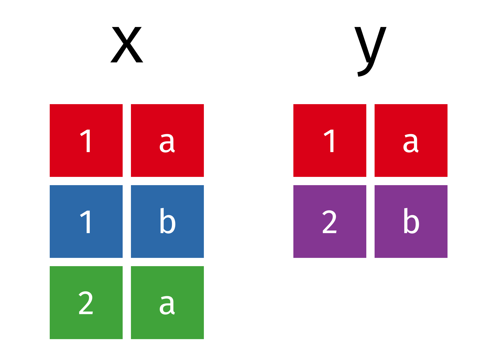

```{r setup, include=FALSE}
knitr::opts_chunk$set(echo = TRUE)
```

Bibiografia da Aula 

Livro R4DS Wickham e Grolemund, cap 13.

Tidy explain  Garrick Aden-Buie disponível em <https://github.com/gadenbuie/tidyexplain>


## Dados Relacionais

É raro ocorrer um trabalho de análise de dados usando apenas uma tabela, pois geralmente tem-se um conjunto de dados espalhado por diversas tabelas, por este motivo para responder às questões de interesse é necessário relaciona-las. Assim, coletivamente, multiplas tabelas de dados são chamadas de *dados relacionais*, por que geralmente o que importa são as relações e não os conjuntos de dados individuais.

As relações são sempre definidas entre um par de tabelas. Todas as outras relações são construídas a partir de uma premissa: as relações de três ou mais tabelas são sempre uma propriedade das relações entre cada par. Em alguns casos dois elemntos de um par podem ser a mesma tabela!Isso é necessário, por exemplo, se houver uma tabela com pessoas e cada pessoa é referenciada a seus pais.

Existem três famílias de verbos para trabalhar com dados relacionais.

 - Mutating joins, permitem que você combine variáveis de duas tabelas. Primeiro relaciona observaações por suas chaves, e então copia as variáveis de uma tabela para outra.
 
 - Filtering Joins, filtra observações de um data frame a partir da coincidência das mesmas em outro conjunto de dados.
 
 - Set operations, trata as observações como elementos fixos.
 
#### Pré-requisitos 

 Vamos explorar os dados relacionais de _nycflights13_ usando os verbos para duas tabelas do dplyr.
 
```{r message=FALSE, warning=FALSE, paged.print=FALSE}
library(tidyverse)
library(nycflights13)
```
 
#### nycflights13

Vamos usar o pacote nycflights13 para aprender sobre dados relacionais. nycflights13 contêm quatro tibbles relacionados ao dataframe _flights_.

 - _airlines_ mostra o nome completo da compania de aviação e seu código.

```{r}
airlines
```

 - _airports_ mostra informações sobre cada aeroporto, identificado pelo código _faa_:
 
```{r}
airports
```
 
 - _planes_ apresenta informações sobre cada avião, identificado por seu _tailnum_(número da calda).
 
```{r}
planes
```
 
 - _weather_ mostra informações do clima em no aeroporto de Nova Yorque para cada hora:
 
```{r}
weather
```
 
 A partir do gráfico abaixo é possível verificar as relações entre cada tabela.
 
 <center>
 
{width=50%}
 </center>
 
 Para nycflights13:
 
 - _flights_ se conectam a _planes_ através de uma única variável, _tailnum_.
 
 - _flights_ se conecta a _airlines_ pela vaariável _carrier_
 
 - _flights_ se conecta a _airports_ de duas maneiras: pelas variáveis _origin_ e _dest_
 
 - _flights_ se conecta a _weather_ através de _origin_ (o lugar), _year_, _month_, _day_ e _hour_.
 
#### Exercícios

1 - Imagine que você gostaria de traçar(aproximadamente)a rota que cada avião faz de sua origem até seu destino. Quais variáveis você precisaria usar? Quais variáveis você precisaria combinar?

2 - Me esqueci de desenhar a relação entre _weather_ e _airports_. Qual e a relação e como ela deveria aparecer no diagrama mostrado anteriormente?

3 - _weather_ contêm apenas informações dos aeroportos de origem (NYC). Se o dataframe também tivesse dados sobre todos os aeorportos dos USA, que relação adicional esta tabela teria com _flights_?

4 - Sabemos que alguns dias do ano são "especiais", que menos vôos ocorrem nesses dias. Como você representaria estes dados em um data frame? Quais seriam as chaves primárias desta tabela? Como ela se conectaria com as tabela existentes?

#### keys

As variáveis usadas para conectar cada par de tabelas são chamadas de keys ou chaves. Uma chave é uma variável (ou conjunto de variáveis) que identifica unicamente uma observação.

Existem dois tipos de chaves:

 - Chave primária(primary key): identifica uma observação única em sua própria tabela. Por exemplo, _planes$tailnum_ é uma chave primária porque identifica unicamente cada avião na tabela _planes_.
 
 - Foreign Key: Identifica uma observação única em outra tabela. Por exemplo, _flights$tailnum_ é uma Foreign Key porque apareça na tabela _flights_ onde relaciona cada vôo a a um avião único.
 
Uma variável também pode ser os dois tipos de chave ao mesmo tempo. Por exemplo, _origin_ é parte da chave primária de _weather_ e tambem é foreign key da tabela _airport_.

Uma vez que você tenha identificado as chaves primárias em suas tabelas, é boa prática verificar se elas realmente identificam unicamente cada observação. Podemos fazer isso com _count()_, contando as chaves primárias e procurando por entradas onde _n_ é maior que um:

```{r}
planes %>% 
  count(tailnum) %>% 
  filter(n > 1)


weather %>% 
  count(year, month, day, hour, origin) %>% 
  filter(n > 1)

```

Pode acontecer de uma tabela não possuir  uma chave primária explicita: cada linha é uma observação, mas nenhuma combinação de variáveis a identifica de forma confiável. Por exeplo, qual é a chave primária na tabela _flights_? Você pode pensar que seria a data mais o número do vôo ou tail number(número da cauda), mas nenhuma das duas é única.

```{r}
flights %>% 
  count(year, month, day, flight) %>% 
  filter(n > 1)


flights %>% 
  count(year, month, day, tailnum) %>% 
  filter(n > 1)

```

Se uma tabela não possui uma chave primária, pode ser bom criar uma com as funções _mutate()_ e _row_number()_. Assim fica mais fácil relacionar observações se os dados foram filtrados é você quer verificar novamente os dados originais. Este tipo de chave é chamada de _surrogate key_.

Uma chave primária e sua correspondente foreign key em outra tabela formam uma realação. Relações são geralmente de um para muitos. Por exemplo, 

#### Exercícios

1 - Faça uma chave surrogate para a tabela _flights_

2 - Identifique as chaves nos seguintes conjuntos de dados:

1. Lahman::Batting,
2. babynames::babynames
3. nasaweather::atmos
4. fueleconomy::vehicles
5. ggplot2::diamonds

(talvez seja necessário instalar alguns pacotes e ler a documentação)

3 - Faça um diagrama ilustrando as conexões entre as tabelas _Batting_, _Master_, e _Salaries_ no pacote Lahman. Faça outro diagrama que deve mostrar as relações entre _Master_, _Managers_, _AwardsManagers_.

Como você caracterizaria a relação entre as tabelas _Batting_, _Pitching_ e _Fielding_.

#### Mutating joins

Como o _mutate()_, as funções join adicionam variáveis a direita, então, se houverem muitas variáveis na tabela elas não aparecerão printadas, por este motivo iremos estreitar as tabelas dos próximos exemplos, criando tabelas menos largas(com menos colunas)

```{r}
flights2 <- flights %>% 
  select(year:day, hour, origin, dest, tailnum, carrier)
flights2

```

(Lembre-se, no RStudio é possível usar _view() para evitar este tipo de problema.)

Imagine que você queira adicionar os nomes de linhas aéreas à tabela _flights2_. Você pode combinar as tabelas _flights_ e _Flights2_ com um _left_join()_:

```{r}
flights2 %>%
  select(-origin, -dest) %>% 
  left_join(airlines, by = "carrier")

```

Como resultado desta junção temos uma nova variável, _name_. Por este motivo chamamos este tipo de join de mutating join. Neste caso, seria possível ter o mesmo resultado usando a função _mutate()_.

```{r}
flights2 %>%
  select(-origin, -dest) %>% 
  mutate(name = airlines$name[match(carrier, airlines$carrier)])

```

Entretanto, este método não é prático quando se precisa relacionar muitas variáveis, além de necessitar de uma leitura mais minunciosa para o seu entendimento.

#### Entendendo Joins

Será mais fácil entender como funcionam os joins com uma representação visual de seu funcionamento:

<center>
 
{width=50%}

</center>

```{r}
#x
#> # A tibble: 3 x 2
#>      id x    
#>   <int> <chr>
#> 1     1 x1   
#> 2     2 x2   
#> 3     3 x3
#y
#> # A tibble: 3 x 2
#>      id y    
#>   <int> <chr>
#> 1     1 y1   
#> 2     2 y2   
#> 3     4 y4
```

As colunas coloridas representam a variável "chave": usadas para relacionas as linhas(observações) entre as duas tabelas. A coluna cinza representa os valores.

Um join é uma maneira de conectar cada linha em x a zero, uma ou mais linhas em Y. Será possível entender melhor este funcionamento nas tabelas animadas que serão mostradas nos próximos exemplos.

#### Inner Join

É o tipo mais simples de Join, relaciona pares de observações quando suas chaves são iguais.

<center>
 
{width=50%}

</center>

```{r}
#inner_join(x, y, by = "id")
#> # A tibble: 2 x 3
#>      id x     y    
#>   <int> <chr> <chr>
#> 1     1 x1    y1   
#> 2     2 x2    y2
```

As observações não relacionadas são ignoradas no output. Não se costuma usar este tipo de join em análises pois facilita a perda de observações.

#### Outer Joins

Preserva observações que aparecem em pelo menos uma das tabelas, existem três tipos:

 - Left join, mantem as observações de X.
 
 <center>
 
{width=50%}

</center>
 
 - right join, mantem as observações em y.
 
 <center>
 
{width=50%}

</center>
 
 - Full join, mantem as observações tanto em x quanto em y.
 
<center>
 
{width=50%}

</center>

O join mais usado é o left join, você pode trazer dados de outra tabela preservando as observações originais.

Outra maneira de representar os joins é através de um diagrama de Venn:

</center>
 
 - Full join, mantem as observações tanto em x quanto em y.
 
<center>
 
{width=50%}

</center>

#### Chaves duplicadas

Até agora, em todos os diagramas assumimos que as chaves eram únicas, porém, não é sempre o caso. Agora vamos entender o que acontece quando as chaves não são únicas. Existem duas possibilidades:

 1 - Uma das tabelas tem chaves duplicadas. isso acontece quando se quer adicionar informações adicionais, assim cria-se uma relação de um para muitos.

<center>
 
{width=50%}

</center>

```{r}
x <- tribble(
  ~key, ~val_x,
     1, "x1",
     2, "x2",
     2, "x3",
     1, "x4"
)
y <- tribble(
  ~key, ~val_y,
     1, "y1",
     2, "y2"
)
left_join(x, y, by = "key")

```

 2 - Existem chaves duplicadas nas duas tabelas. Isto geralmente é um erro porque em nenhuma das duas tabelas as chaves identificam de forma única uma observação.
 
 <center>
 
{width=50%}

</center>

```{r}
x <- tribble(
  ~key, ~val_x,
     1, "x1",
     2, "x2",
     2, "x3",
     3, "x4"
)
y <- tribble(
  ~key, ~val_y,
     1, "y1",
     2, "y2",
     2, "y3",
     3, "y4"
)
left_join(x, y, by = "key")

```

#### Definindo as colunas chave

Até agora, os pares de tabelas foram sempre unidas por uma única variável e essa variável tem o mesmo nome nas duas tambelas. Esta restrição foi codificada por _by="key"_ . É possível usar outros valores para _by_ para conectar tabelas de outras maneiras:

 - O deafault, _by=null_, usa todas as variáveis que aparecem nas duas tabelas, chamado de união natural. Por exemplo, as tabelas flights e weather se relacionam em suas variáveis comuns: year, month, day, hour e origin.

```{r}
flights2 %>% 
  left_join(weather)

```

 - Um vetor caracter, _by="x"_. É como um join natural, mas usa apenas algumas das variáveis comuns. Por exemplo, flights e planes tem variáveis _year_, mas elas tem significados diferentes então unimos as tabelas apenas por _tailnum_
 
```{r}
flights2 %>% 
  left_join(planes, by = "tailnum")

```
 
 - Um vetor caracter nomeado: _by = c("a" = "b")_ . Isso vai relacionar a variável a na tabela x a uma variável b na tabela y.
 
Por exemplo, se quisermos desenhar um mapa precisamos combinar os dados de flights e airports que contem a localização de cada aeroporto.  Cada vôo tem uma origem e um destino _airport_, então precisamos especificar qual queremos unir a qual.


```{r}
flights2 %>% 
  left_join(airports, c("dest" = "faa"))


flights2 %>% 
  left_join(airports, c("origin" = "faa"))

```

#### Exercícios

 1 - Compute o atraso médio por destino, então una aos dados da tabela _airports_, assim você poderá mostrar a distribuição espacial dos atrasos. Aqui esta um modo fácil de plotar um mapa dos estados unidos.
 
```{r}
airports %>%
  semi_join(flights, c("faa" = "dest")) %>%
  ggplot(aes(lon, lat)) +
    borders("state") +
    geom_point() +
    coord_quickmap()
```
 
Voce talvez queira usar _size_ ou _color_ dos pontos para mostrar o atraso médio em cada aeroporto.

 2 - Adicione a localização da origem e do destino a tabela _flights_
 
 3 - Existe relação entre a idade do avião e seus atrasos?
 
 4 - Que condições climáticas influenciam nos atrasos?
 
 5 -O que aconteceu em 13 de junho de 2013? Mostre o padrão espacial de atrasos, use o google para fazer uma referência crusada com o clima no dia.
 

#### Filtering Joins

Filtering joins relacionam observações do mesmo modo que muatating joins, mas afetam as observações, não as variáveis. Existem 2 tipos.

 - _semi_join(x,y)_ mantêm todas as orbservações em x que tenham uma correspondência em y.
 
```{r}
#semi_join(x, y, by = "id")
#> # A tibble: 2 x 2
#>      id x    
#>   <int> <chr>
#> 1     1 x1   
#> 2     2 x2
```
 
 
  <center>
 
{width=50%}

</center>
 
 - _anti_join(x,y)_ Ignora todas as observações em x que tenham correspondência em y.
 
```{r}
#anti_join(x, y, by = "id")
#> # A tibble: 1 x 2
#>      id x    
#>   <int> <chr>
#> 1     3 x3
```
 
 
  <center>
 
{width=50%}

</center>
 
 Semi-joins são úteis ao relacionar tabelas de sumário filtradas de volta para as linhas originais. Por exemplo, imagine que você encontrou os 10 destinos mais populares:
 
```{r}
top_dest <- flights %>%
  count(dest, sort = TRUE) %>%
  head(10)
top_dest
```
 
 Agora você quer encontrar cada vôo que foi para cada um destes destinos. Você poderia fazer um filtro:
 
```{r}
flights %>% 
  filter(dest %in% top_dest$dest)
```
 
 Mas é difícil fazer o mesmo para múltiplas variáveis. Por exemplo, imagine que você encontrou os 10 dias com maiores atrasos médios. Como você construiria um filtro que usasse _year_, _month_ e _day_ para relacionar a de volta a tabela _flights_?
 
 Ao invés disso você pode usar um semi-join, que conecta as duas tabelas como um mutating join, mas ao invés de adicionar novas colunas, mantem apenas as colunas de x que tem uma correspondência em y.
 
 _y_
 

```{r}
flights %>% 
  semi_join(top_dest)
```
 
 
 Anti-joins são úteis na identificação de falta de correspondência. Por exemplo, conectando _flights_ e _planes_ você pode se interessar em saber que existem muitos vôos que não tem correspondência em _planes_.
 
```{r}
flights %>%
  anti_join(planes, by = "tailnum") %>%
  count(tailnum, sort = TRUE)
```
 
#### Execícios

1 - Qual o siginificado de um vôo ter um _tailnum_ faltante? O que os tail numbers que não tem uma correspondência em _planes_ tem em comum?(dica: uma variável explica ~90% dos problemas.) 

2 - Filtre _flights_ para mostrar mostrar apenas os vôos com aviões que tenham feito pelo menos 100 vôos.

3 - Combine fueleconomy::vehicles e fueleconomy::common para encontrar apenas os registros dos modelos mais comuns.
 
4 - Encontre as 48 horas( no decorrer de um ano inteiro) que tem os piores atrasos. Faça a referência cruzada com os dados de _weather_. Consegue ver os padrões?

5 - O que anti_join(flights, airports, by = c("dest" = "faa")) te diz?
    O que anti_join(airports, flights, by = c("faa" = "dest")) te diz?

6 - Você pode esperar que haja uma relação implicita entre avião e linha aerea, poque cada avião voa por uma unica linha aerea. Confirme ou rejeite esta hipótese usando as ferramentas que você aprendeu até agora.

#### Problemas com Join

Os dados com que temos trabalhado ate agora foram preparados para que você tivesse a menor quantidade possível de problemas até agora. Seus próprios dados ou tabelas provavelmente não vão estar do mesmo modo, então aqui vão algumas dicas que você deve aplicar a suas próprias tabelas para fazer com que seus joins funcionem perfeitamente.
    
1 - Comece identificando as variáveis que formam as chaves primárias em cada tabela. Você normalmente deve fazer isso baseado em seus conhecimentos sobre os dados, não empiricamente olhando combinaçoes de dados que dão um identificador único. Se você olhar para as variáveis sem pensar em seu significado, talvez não dê sorte e encontre combinações que são únicas em sua tabela mas a relação não é verdadeira em geral.

Por exemplo, a altitude e a longitude identifica unicamente cada aeroporto mão não são bons identificadores.

```{r}
airports %>% count(alt, lon) %>% filter(n > 1)
```

2 - Verifique se nenhuma das variáveis na chave primária está faltando. Se algum valor estiver faltando não há como identificar uma observação.

3 - Verifique se suas foreign keys correspondem chaves primárias em outra tabela. O melhor modo de fazer isso é com um _anti_join()_ . è comum que chaves não tenham correspondência por conta de erros de entrada.

Se você tem chaves faltantes, você analisar de forma cuidadosa o uso de inner joins vs. outer joins, considerando cuidadosamente se você quer ou não linhas que não tem correspondência.

Tenha conciência de que apenas checar o número de colunas antes e depois dos joins não é o suficiente para assegurar que o join deu certo. Se você tiver um inner join com chaves duplicadas em ambas as tabelas, você pode não dar sorte e o número de linhas descartadas ser igual ao número de linhas iguais.

#### Set operations

São úteis quando se quer quebrar um filtro mais complexo em partes menores. Todas estas operações funcionam com uma linha completa, comparando o valor de cada variável. Elas esperam que as entradas de x e y tenham a mesma variável, e tratam as observações como conjuntos:

 <center>
 
{width=50%}

 </center>

```{r}
#x
#> # A tibble: 3 x 2
#>   x     y    
#>   <chr> <chr>
#> 1 1     a    
#> 2 1     b    
#> 3 2     a
#y 
#> # A tibble: 2 x 2
#>   x     y    
#>   <chr> <chr>
#> 1 1     a    
#> 2 2     b
```


 - intersect(x, y): retorna apenas observações presentes em x e y
 
 <center>
 
{width=50%}

 </center>


```{r}
#intersect(x, y)
#> # A tibble: 1 x 2
#>   x     y    
#>   <chr> <chr>
#> 1 1     a
```


 - union(x, y): Retorna observações únicas em x e y.
 
 <center>
 
{width=50%}

  </center>
 
```{r}
#union(x, y)
#> # A tibble: 4 x 2
#>   x     y    
#>   <chr> <chr>
#> 1 2     b    
#> 2 2     a    
#> 3 1     b    
#> 4 1     a
```

 - Union_All(x,y) -  Todas as linhas de x e y mantem as observações duplicadas.
 
<center>
 
{width=50%}

</center>
 
```{r}
#union_all(x, y)
#> # A tibble: 5 x 2
#>   x     y    
#>   <chr> <chr>
#> 1 1     a    
#> 2 1     b    
#> 3 2     a    
#> 4 1     a    
#> 5 2     b
```


 - setdiff(x,y) - Retorna as observações em x maas não em y.
 
<center>
 
{width=50%}

</center>
 
```{r}
#setdiff(x, y)
#> # A tibble: 2 x 2
#>   x     y    
#>   <chr> <chr>
#> 1 1     b    
#> 2 2     a
```


